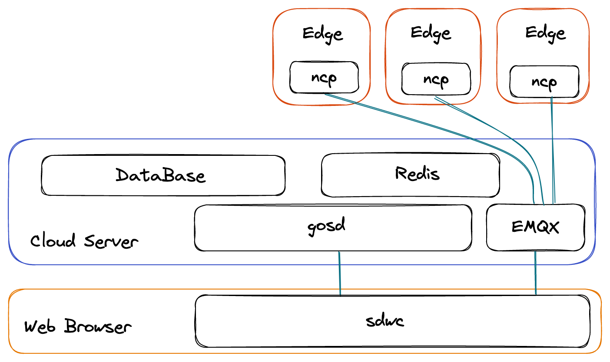
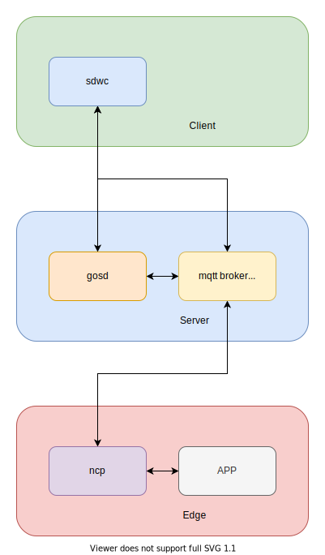

# developer

developer-center. architecture

## sdwc

Client, webapp. Multiple drones and ground station Web consoles

## gosd

Web server Backend, Management System

## Mqtt broker

you can use:

- [Mosquitto >= 1.6](https://github.com/eclipse/mosquitto/)
- [Emqx](https://github.com/emqx/emqx)

## ncp

Edge gateway. Configuration definition action

