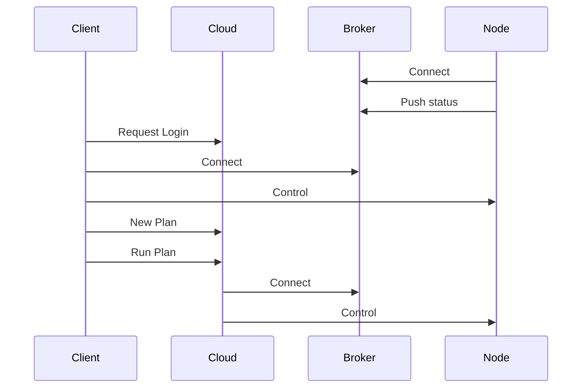

# Architecture



```
      Cloud -- Broker
     /       /     \\
    /      /        \ \
   /     /           \  Node -- Drone
  /    /              \
Client                 Node -- Depot
```

### Level

```
                           Time Scheduler                  cloud
                           Plan (Lua VM)                   cloud
tcp <-> ncp <-> Mqtt <->  jsonrpc2 / status <-> MQTT <->   cloud / SDWC.node
```

## Cloud

gosd (Closed source)

System Management Service

Communication center, database storage

## Node

ncp (Closed source)

Communication middleware

## Broker

MQTT Broker

Communication middleware


